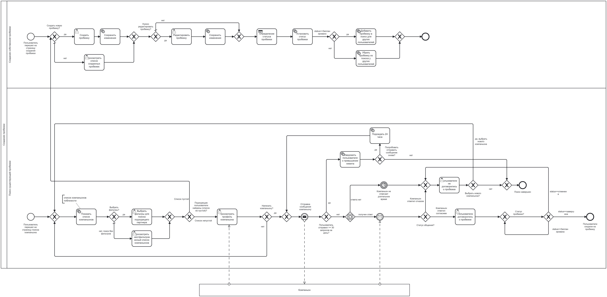

**`BPMN и DMN документация`**

---

## Таблица BPMN

### Краткое описание

Данный BPMN-процесс описывает основные действия и события, связанные с организацией пробежек через приложение RunMate. Процесс включает создание пробежки, поиск компаньона, переход в активный статус и завершение пробежки. 

---

## Таблица DMN

### Описание DMN-таблицы

Для описания логики переходов между статусами пробежки была создана DMN-таблица, которая определяет правила обработки различных событий. Это позволяет четко и прозрачно описать возможные переходы между состояниями.

### Состояния пробежки

У пробежки могут быть следующие состояния:

- **Запланировано (Planned)**  
- **Компаньон найден (Companion found)**  
- **Отменено (Cancelled)**  
- **В процессе (In progress)**  
- **Завершено (Completed)**  

### Логика переходов между состояниями

1. Когда пользователь создает пробежку, ей автоматически присваивается статус **"Запланировано"**.
2. **От "Запланировано"** возможны следующие переходы:  
   - В **"Компаньон найден"**, если найден партнер по пробежке.  
   - В **"Отменено"**, если пользователь отменяет пробежку.  
   - В **"В процессе"**, если пробежка началась.  
3. **От "Компаньон найден"** возможны переходы:  
   - В **"В процессе"**, если пробежка началась.  
   - В **"Отменено"**, если пользователь отменяет пробежку.  
4. **От "В процессе"** возможен только переход в **"Завершено"**, когда пробежка завершена.

---

### DMN-таблица: *Jog Status*

### Преимущества использования DMN

- **Четкость логики**: DMN-таблица позволяет явно указать все возможные переходы между статусами.  
- **Легкость в поддержке**: Простая настройка позволяет изменять бизнес-логику без необходимости переписывания кода.  
- **Прозрачность**: Каждое действие имеет четко определенные результаты, что упрощает анализ и отладку.

---